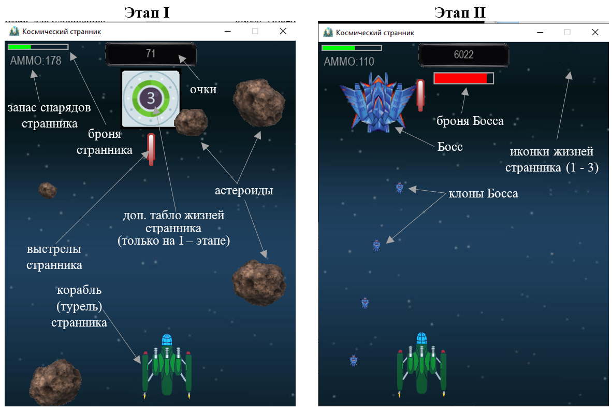

<h1>Игра Shmup</h1> 

Простейший шутер: как **второй проект** в качестве аттестации в Лицее Академии Яндекса

Установка и запуск:

 
 1. В первую очередь необходимо установить все необходимые зависимости (requirements.txt - есть в архиве).

    pip install -r requirements.txt

 2. Запустить скрипт: main.py 

<b>Описание приложения</b>

Аркадные игры (*аркады*) – без преувеличения, являются основой видео- и
компьютерных игр. Данный жанр, зародившийся в уже далёком 1971 году,
характеризуется коротким по времени, но интенсивным игровым процессом.

Представляемая вниманию игра – простейшая «Стрелялка» в жанре Shoot 'em up (с
англ. shoot them up — «перестреляй их всех»).

Игрок (далее - *странник*) – пилот маленького космического корабля, который
возвращается на родную планету и пытается выжить среди метеоритов. Он вынужден
сразиться с привратником галактики, чтобы завершить миссию.

Такова идея… 

Странник, изначально, обладает тремя жизнями и 200-ми снарядами. Каждая жизнь
состоит из 100 единиц брони.

В заставке отражены клавиши управления и возможный инвентарь для улучшения:

 

Игровой процесс (gameplay, как и отмечено выше) состоит из двух этапов:

1.  Случайное появление NPC-астероидов1 разного размера, с различной
    скоростью и направлением движения.

    1 - NPC - non-player character – игровой объект, не управляемый игроком.

Столкновение NPC-астероида с кораблём странника сопровождается незначительными
по размерам вспышками, отражающими нарушение брони (уменьшение её числа
единиц).

Каждый сбитый NPC-астероид, в зависимости от его размеров, увеличивает очки
игрока на соответствующее количество единиц.

Если единицы брони снижаются до нуля, то текущая жизнь странника теряется.

Потеря последней жизни сопровождается большим взрывом, исчезновением игрока,
временным возникновением сообщения «Ты проиграл!» и переходом на заставку с
достижениями.

Если игрок, управляющий странником, так и не набрал пороговое значение очков
(выбирается в начале игры или рестарта в диапазоне от 5000 до 7000), то переход
на второй этап не осуществляется.

В заставке с достижениями, в числе прочего, будет значиться: «Босс: Не пройден!»

2.  Появление стража галактики (Босса), которому предшествует кратковременная
    заставка «Ну, держись!».

Как отмечалось, переход на второй этап возможен, если игрок, управляющий
странником набрал число очков в диапазоне от 5000 до 7000. Босс представляет
собой космический корабль, который случайно перемещается, затрудняя попадание в
него. Босс постоянно выпускает своих маленьких клонов, наносящих ущерб кораблю
странника. Клоны нельзя сбить, от них можно только уклоняться.

В процессе сражения с Боссом у странника всего одна жизнь (которая при старте
второго этапа единовременно обновляется до 100 единиц, вне зависимости от уровня
завершения первого этапа) и 200 снарядов (их нельзя пополнить). Броню нельзя
улучшить. Если броня странника или число снарядов обнулены, — схватка с боссом
проиграна. Проигрыш в схватке также сопровождается временным возникновением
сообщения «Ты проиграл!». При этом, в заставке с достижениями также будет
значиться: «Босс: Не пройден!».

Победа над Боссом, напротив, сопровождается временным возникновением сообщения
«Победа!». В заставке с достижениями, в числе прочего, будет значиться: «Босс:
Повержен!»

<b>ГЕЙМПЛЕЙ</b>

 

 

 

<b>Фрагмент заставки с достижениями</b>

Сравнительная характеристика достижений возможна за счёт использования базы
данных (файл: "**scores_db.db**"). В текущем варианте база данных состоит из одной таблицы, где постоянно
обновляются достижения за прошлый геймплей, с фиксацией даты и времени.

Состав программы:

 

Примечание: турель игрока может быть заменена.
